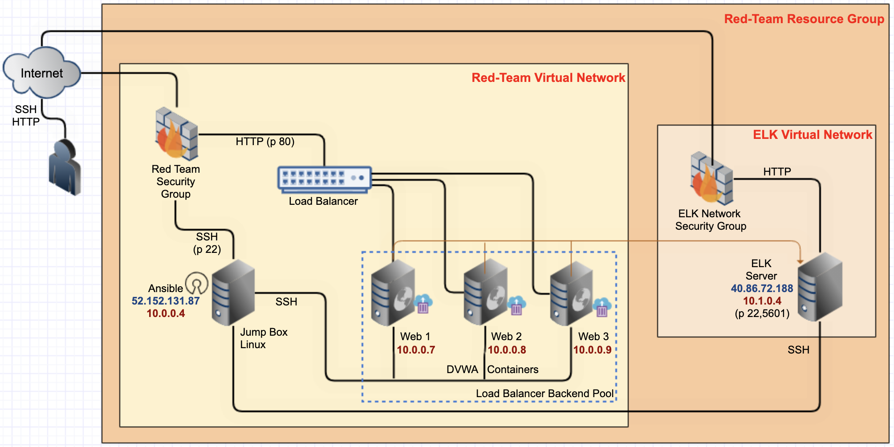

## PROJECT I
## Automated ELK Stack Deployment

The files in this repository were used to configure the network depicted below.

These files have been tested and used to generate a live ELK deployment on Azure. They can be used to either recreate the entire deployment pictured above. Alternatively, select portions of the Ansible file may be used to install only certain pieces of it, such as Filebeat.

  Ansible/filebeat

This document contains the following details:
- Description of the Topology
- Access Policies
- ELK Configuration
  - Beats in Use
  - Machines Being Monitored
- How to Use the Ansible Build

### Description of the Topology

- The main purpose of this network is to expose a load-balanced and monitored instance of DVWA, the D*mn Vulnerable Web Application.
- Load balancing ensures that the application will be highly available, in addition to restricting access to the network.
- Load balancers protect: Protect applications from emerging threats

The advantage of a JumpBox is the orgination point for launching Administrative Tasks. This ultimately sets the JumpBox as a SAW (Secure Admin Workstation). All Administrators when conducting any Administrative Task will be required to connect to the JumpBox before perfoming any task/assignment.

Integrating an ELK server allows users to easily monitor the vulnerable VMs for changes to the logs and system traffic.

- Filebeat watches for log files/locations and collects log events
- Metricbeat records metrics from the operating system and from services running on the server

The configuration details of each machine may be found below.

| Name     | Function | IP Address | Operating System |
|----------|----------|------------|------------------|
| Jump Box | Gateway  | 10.0.0.4   | Linux            |
| ELK-VM   | Server   | 10.1.0.4   | Linux            |
| Web 1    | DVWA     | 10.0.0.7   | Linux            |
| Web 2    | DVWA     | 10.0.0.8   | Linux            |
| Web 3    | DVWA     | 10.0.0.9   | Linux            |

### Access Policies

The machines on the internal network are not exposed to the public Internet. 

Only the Jumpbox machine can accept connections from the Internet. Access to this machine is only allowed from the following IP addresses:
- Personal IP Address

Machines within the network can only be accessed by SSH.
- The only machine that is able to connect to the ELK-VM (10.1.0.4) is via JumpBox from Private IP (10.0.0.4)

A summary of the access policies in place can be found in the table below.

| Name     | Publicly Accessible | Allowed IP Addresses |
|----------|---------------------|----------------------|
| Jump Box | No                  | Personal IP          |
| ELK-VM   | No                  | 10.0.0.4 		    |
| Web 1    | No                  | 10.0.0.4             |
| Web 2    | No                  | 10.0.0.4             |
| Web 3    | No                  | 10.0.0.4             |

### Elk Configuration

Ansible was used to automate configuration of the ELK machine. No configuration was performed manually, which is advantageous because...
- The main advantages of automating configuration through Ansible are ease of use and an effortless learning curve. Through Playbooks, you can configure multiple Machines through the use of a single command after initial configuration

The playbook implements the following tasks:
- Create a New VM ("ELK-VM") Keep note of the Private IP (10.1.0.4) and the Public IP; you will need the Private IP to SSH into the VM and the Public IP to connect to the Kibana Portal (HTTP Site) to view all Metrics/Syslogs
- Download and configure the "elk-docker" container " in the hosts. You will need to add a new security group [elkservers] and the Private IP (10.1.0.4) to the group. Then you need to create a new ansible-playbook (elk-install) that will download, install, configures the "ELK-VM" to map the following ports [5601,9200,5044], and starts the container
- Launch and expose the container "After installing and starting the new container. You can verify that the container is up and running by SSHing into the container from your JumpBox
- Create new Inbound Security Rules to allow Ports: 5601, 9200, 5044 "The Inbound Security Rules should allow access from your Personal Network"
- Open a new browser and type in the (http://[your.VM.IP]:5601/app/kibana) to access the Kibana Portal Site

The following screenshot displays the result of running `docker ps` after successfully configuring the ELK instance.

### Target Machines & Beats
This ELK server is configured to monitor the following machines:
- 10.0.0.7, 10.0.0.8, 10.0.0.9

We have installed the following Beats on these machines:
- Filebeat and Metricbeat

These Beats allow us to collect the following information from each machine:
- Filebeat is a lightweight shipper for forwarding and centralizing log data. Filebeat monitors log files or locations you specify, collects log events, and forwards them to Elasticsearch or Logstash for indexing
- Metricbeat collects metrics from the operating system and services running on the server. Metricbeat then takes the metrics and statistics that it collects and ships them to the specified output

### Using the Playbook
In order to use the playbook, you will need to have an Ansible control node already configured. Assuming you have such a control node provisioned: 

SSH into the control node and follow the steps below:
- Copy the filebeat.yml and metricbeat.yml files to the /etc/ansible/roles/files/ directory
- Update the configuration files to include the Private IP of the ELK-VM to the ElasticSearch and Kibana sections of the configuration file
- Run the playbook, and navigate to ELK-VM to check that the installation worked as expected

TODAnswer the following questions to fill in the blanks:
- Which file is the playbook? Where do you copy it?
  The playbook is called filebeat-install.yml. You copy the file to the "/etc/ansible/hosts/" directory
- Which file do you update to make Ansible run the playbook on a specific machine? How do I specify which machine to install the ELK server on versus which to install Filebeat on?
  The file you need to update is the filebeat.yml file, a configuration file that will be dropped into the Elk-VM during the ansible-playbook. When you update the host.cfg file in the ansible directory, you will need to create a new group called [elkservers] and add the Private IP of the Elk-Server to the group. When configuring the filebeat.yml file, you need to designate the Private IP of the Elk-Server in two lines of the .yml file. Lines 1106 and 1806 are required to be updated with the Private IP
- Which URL do you navigate to in order to check that the ELK server is running?
  (http://[your.VM.IP]:5601/app/kibana)

